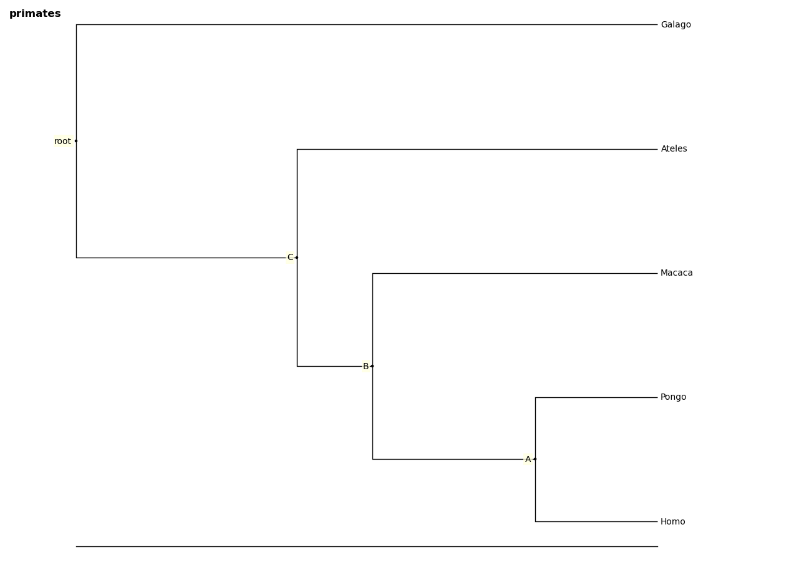
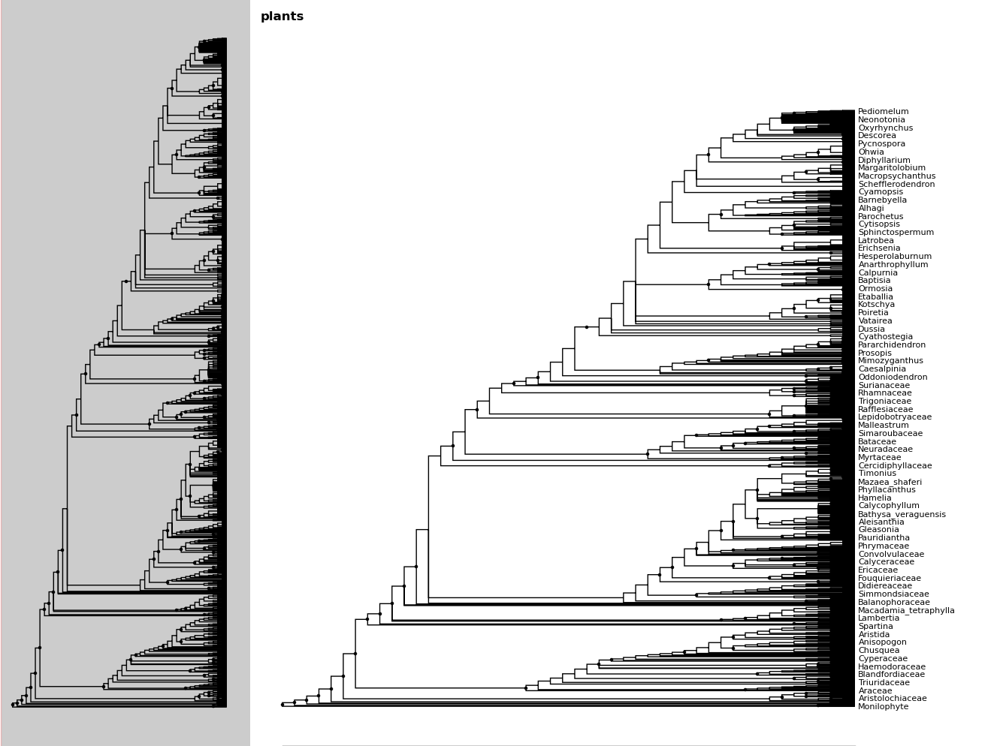
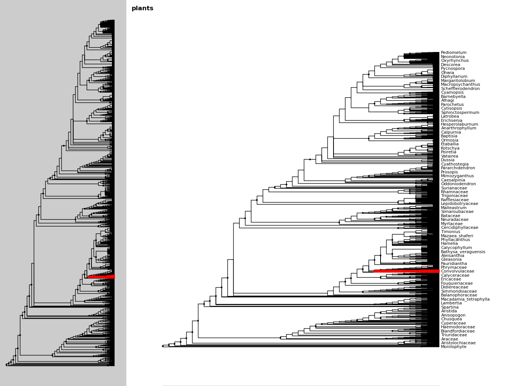
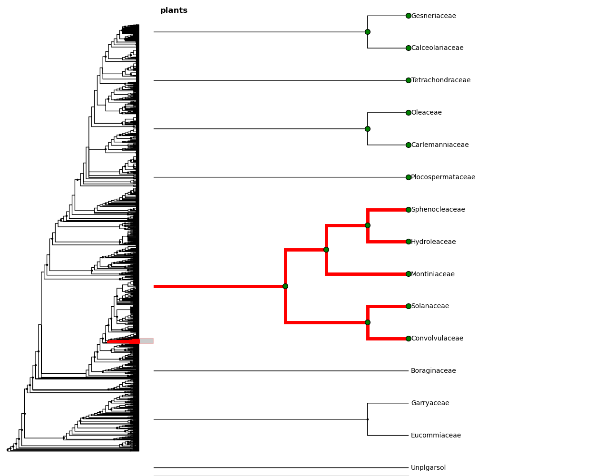
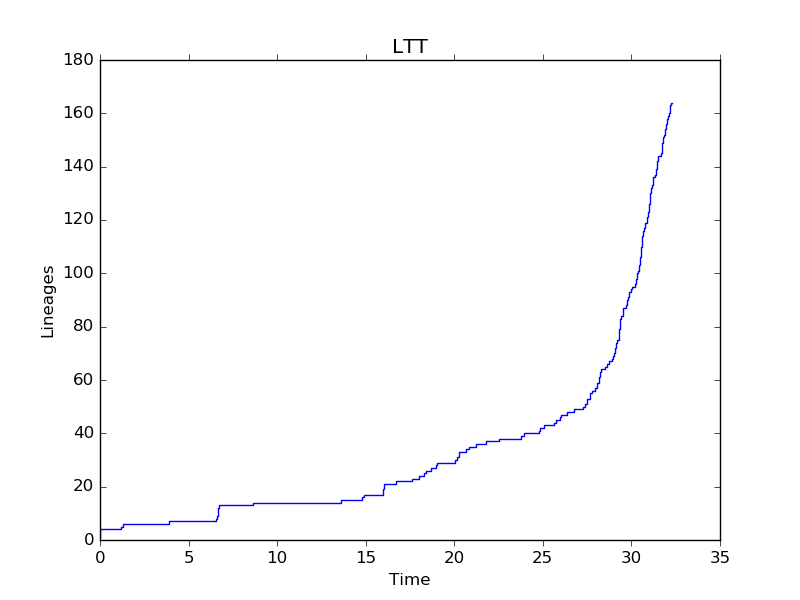

.. _users-guide

************
User's Guide
************

``ivy`` is designed to be used both as a library and interactively, in
the IPython shell.  `IPython <http://ipython.scipy.org>`_ is an
enhanced Python interpreter designed for interactive and exploratory
scientific computing.

This `screencast <http://vimeo.com/23646898>`_ demonstrates some basic
concepts:

.. raw:: html

    <iframe
     src="http://player.vimeo.com/video/23646898?title=0&amp;byline=0&amp;portrait=0"
     width="400" height="208" frameborder="0"></iframe>

    
<a href="http://vimeo.com/23646898" target="_blank">Watch in
     full resolution (opens in new window)</a>

Quickstart
==========

Starting the shell
------------------

The ``-pylab`` option starts IPython in a mode that imports a number
of functions from matplotlib and numpy, and allows interactive
plotting.

.. code-block:: bash

    $ ipython -pylab

In interactive mode, ``ivy`` provides some useful shortcut functions
(e.g., readtree, readaln, treefig, alnfig) that you will typically
want to import as follows.

.. sourcecode:: ipython

    In [1]: from ivy.interactive import *

Viewing a tree
--------------

Assuming you have started the shell,

.. sourcecode:: ipython

   In [2]: s = "examples/primates.newick"
   In [3]: fig = treefig(s)

Here, the variable *s* can be a newick string, the name (path) of a
file containing a newick tree, or an open file containing a newick
string.  Note that file paths are completed dynamically in ipython by
hitting the <TAB> key, making it easy to find files with little
typing.

A new window should appear, controlled by the variable *fig*.  View
the help for *fig*::

   fig?

Trees in Ivy
=============

``ivy`` does not have a tree class per se; rather trees in ``ivy`` exist as collections
of nodes. In ``ivy``, a ``Node`` is a class that contains information about a node.
``Nodes`` are rooted and recursively contain their children. Functions
in ``ivy`` act directly on ``Node`` objects. Nodes support Python idioms such as ``in``,
``[``, iteration, etc. This guide will cover how to read, view, navigate, modify,
and write trees in ``ivy``.

Reading
-------

You can read in trees using ``ivy``'s ``tree.read`` function. This function supports
newick and nexus files. The ``tree.read`` function can take a file name, a file
object, or a Newick string as input. The output of this function is the root
node of the tree.

.. sourcecode:: ipython

    In [*]: import ivy
    In [*]: f = open("examples/primates.newick")
    In [*]: r = ivy.tree.read(f)
    In [*]: f.close()
    In [*]: r = ivy.tree.read("examples/primates.newick")
    In [*]: r = ivy.tree.read(
                "((((Homo:0.21,Pongo:0.21)A:0.28,Macaca:0.49)"
                "B:0.13,Ateles:0.62)C:0.38,Galago:1.00)root;")
    In [*]: # These three methods are identical

You can copy a read tree using the ``copy_new`` method on the root node. ``Node``
objects are mutable, so this method is preferred over ``r2 = r`` if you want
to create a deep copy.

.. sourcecode:: ipython

    In [*]: r2 = r.copy_new(recurse=True) # If recurse=False, won't copy children.

Viewing
-------

There are a number of ways you can view trees in ``ivy``. For a simple display
without needing to create a plot, ``ivy`` can create ascii trees that can be
printed to the console.

.. sourcecode:: ipython

    In [*]: print r.ascii # You can use the ascii method on root nodes.
                                   ---------+ Homo
                          --------A+
                 --------B+        ---------+ Pongo
                 :        :
        --------C+        ------------------+ Macaca
        :        :
    root+        ---------------------------+ Ateles
        :
        ------------------------------------+ Galago

For a more detailed and interactive tree, ``ivy`` can create a plot using
``matplotlib``. More detail about visualization using ``matplotlib`` are in the
"Visualization with matplotlib" section.

.. sourcecode:: ipython

    In [*]: import ivy.vis
    In [*]: fig = ivy.vis.treevis.TreeFigure(r)
    In [*]: fig.show()

.. image:: _images/primate_mpl.png
    :width: 700

You can also create a plot using ``Bokeh``.

.. sourcecode:: ipython

    In [*]: import ivy.vis.bokehtree
    In [*]: fig2 = ivy.vis.bokehtree.BokehTree(r)
    In [*]: fig2.drawtree()

.. image:: _images/primate_bokeh.png
    :width: 700

Navigating
----------

A node in ``ivy`` is a container. It recursively contains its descendants,
as well as itself. You can navigate a tree using the Python idioms that
you are used to using.

Let's start by iterating over all of the children contained within the root
node. By default, iteration over a node happens in preorder sequence, starting
with the root node. To iterate over a node in a specific sequence, you can use
the ``preorder`` and ``postorder`` methods.

.. sourcecode:: ipython

    In [*]: len(r)
    Out[*]: 9 # Length of a node = number of descendants + self
    In [*]: for node in r:
                print node # Default is preorder sequence
    Node(139624003155728, root, 'root')
    Node(139624003155536, 'C')
    Node(139624003155600, 'B')
    Node(139624003155664, 'A')
    Node(139624003155792, leaf, 'Homo')
    Node(139624003155856, leaf, 'Pongo')
    Node(139624003155920, leaf, 'Macaca')
    Node(139624003155984, leaf, 'Ateles')
    Node(139624003156048, leaf, 'Galago')
    In [*]: for node in r.preiter():
                print node # Same as above
    Node(140144824314320, root, 'root')
    Node(140144824314384, 'C')
    Node(140144824314448, 'B')
    Node(140144824314512, 'A')
    Node(140144824314576, leaf, 'Homo')
    Node(140144824314192, leaf, 'Pongo')
    Node(140144824314256, leaf, 'Macaca')
    Node(140144824314640, leaf, 'Ateles')
    Node(140144824314704, leaf, 'Galago')
    In [*]: for node in r.postiter():
                print node # Nodes in postorder sequence.
    Node(140144824314576, leaf, 'Homo')
    Node(140144824314192, leaf, 'Pongo')
    Node(140144824314512, 'A')
    Node(140144824314256, leaf, 'Macaca')
    Node(140144824314448, 'B')
    Node(140144824314640, leaf, 'Ateles')
    Node(140144824314384, 'C')
    Node(140144824314704, leaf, 'Galago')
    Node(140144824314320, root, 'root')

We can access internal nodes using square brackets on the root node (or other
ancestor node).

.. sourcecode:: ipython

    In [*]: r["C"] # You can use the node label
    Out[*]: Node(139624003155536, 'C')
    In [*]: r[139624003155536] # The node ID
    Out[*]: Node(139624003155536, 'C')
    In [*]: r[1] # Or the index of the node in preorder sequence
    Out[*]: Node(139624003155536, 'C')

We can access the information a node has about which other nodes it is
connected to using the ``children`` and ``parent`` attributes, which return
the nodes directly connected to the current node. The ``descendants`` method, on
the other hand, recursively lists all descendants of a node (not including
the node itself)

.. sourcecode:: ipython

    In [*]: r["C"].children
    Out[*]: [Node(139624003155600, 'B'), Node(139624003155984, leaf, 'Ateles')]
    In [*]: r["B"].parent
    Out[*]: Node(139624003155536, 'C')
    In [*]: r["B"].descendants()
    Out[*]:
    [Node(139624003155664, 'A'),
     Node(139624003155792, leaf, 'Homo'),
     Node(139624003155856, leaf, 'Pongo'),
     Node(139624003155920, leaf, 'Macaca')]

We can search nodes using regular expressions with the ``Node`` ``grep`` method.
We can also ``grep`` leaf nodes and internal nodes specifically.

.. sourcecode:: ipython

    In [*]: r.grep("A") # By default, grep ignores case
    Out[*]:
    [Node(139624003155664, 'A'),
     Node(139624003155920, leaf, 'Macaca'),
     Node(139624003155984, leaf, 'Ateles'),
     Node(139624003156048, leaf, 'Galago')]
    In [*]: r.grep("A", ignorecase = False)
    Out[*]: [Node(139624003155664, 'A'), Node(139624003155984, leaf, 'Ateles')
    In [*]: r.lgrep("A", ignorecase = False) # Limit our search to leaves
    Out[*]: [Node(140144824314640, leaf, 'Ateles')]
    In [*]: r.bgrep("Homo", ignorecase = False) # Limit our search to branches
    Out[*]: []

We can also search for nodes that match a certain criterion using the
``find`` method. ``find`` takes a function that takes a node as its
first argument and returns a ``bool``.

.. sourcecode:: ipython

    In [*]: def three_or_more_decs(node):
                return len(node) >= 4
    In [*]: r.find(three_or_more_decs) # Find returns a generator
    Out[*]: <generator object find at 0x7efcbf498730>
    In [*]: r.findall(three_or_more_decs) # Findall returns a list
    Out[*]:
    [Node(139624003155728, root, 'root'),
     Node(139624003155536, 'C'),
     Node(139624003155600, 'B')]

Testing
-------

We can test many attributes of a node in ``ivy``.

We can test whether a node contains another node

.. sourcecode:: ipython

    In [*]: r["A"] in r["C"]
    Out[*]: True
    In [*]: r["C"] in r["A"]
    Out[*]: False
    In [*]: r["C"] in r["C"]
    Out[*]: True # Nodes contain themselves

We can test if a node is the root

.. sourcecode:: ipython

    In [*]: r.isroot
    Out[*]: True
    In [*]: r["C"].isroot
    Out[*]: False

We can test if a node is a leaf

.. sourcecode:: ipython

    In [*]: r.isleaf
    Out[*]: False
    In [*]: r["Homo"].isleaf
    Out[*]: True

We can test if a group of leaves is monophyletic

.. sourcecode:: ipython

    In [*]: r.ismono(r["Homo"], r["Pongo"])
    Out[*]: True
    In [*]: r.ismono(r["Homo"], r["Pongo"], r["Galago"])
    Out[*]: False

Modifying
---------

The ``ivy`` ``Node`` object has many methods for modifying a tree in place.

Removing
~~~~~~~~

There are two main ways to remove nodes in ``ivy``; collapsing and pruning.

Collapsing removes a node and attaches its descendants to the node's parent.

.. sourcecode:: ipython

    In [*]: r["A"].collapse()
    In [*]: print r.ascii()
                                ------------+ Macaca
                                :
                    -----------B+-----------+ Homo
                    :           :
        -----------C+           ------------+ Pongo
        :           :
    root+           ------------------------+ Ateles
        :
        ------------------------------------+ Galago

Pruning removes a node and its descendants

.. sourcecode:: ipython

    In [*]: cladeB = r["B"] # Store this node: we will add it back later
    In [*]: r["B"].prune()
    In [*]: print r.ascii()
        -----------------C+-----------------+ Ateles
    root+
        ------------------------------------+ Galago

You can see that the tree now has a 'knee': clade C only has one child and
does not need to exist on the tree. We can remove it with another method of
removing nodes: ``excise``. Excising removes a node from between its parent
and its single child.

.. sourcecode:: ipython

    In [*]: r["C"].excise()
    In [*]: print r.ascii()
        -------------------------------------+ Galago
    root+
        -------------------------------------+ Ateles

It is important to note that although the tree has changed, the nodes in the
tree retain some of their original attributes, including their indices:

.. sourcecode:: ipython

    In [*]: r[0]
    Out[*]: Node(140144821291920, root, 'root')
    In [*]: r[1] # Node 1 ("C") no longer exists
    ---------------------------------------------------------------------------
    IndexError                                Traceback (most recent call last)

    IndexError: 1
    In [*]: r[7] # You can access existing nodes with their original indices
    Out[*]: Node(140144821292368, leaf, 'Ateles')

To recap:
#. ``collapse`` removes a node and adds its descendants to its parent
#. ``prune`` removes a node and also removes its descendants
#. ``excise`` removes 'knees'

Adding
~~~~~~

Our tree is looking a little sparse, so let's add some nodes back in. There
are a few methods of adding nodes in ``ivy``. We will go over ``biscect``,
``add_child``, and ``graft``

Bisecting creates a 'knee' node halfway between a parent and a child.

.. sourcecode:: ipython

    In [*]: r["Galago"].bisect_branch()
    Out[*]: Node(140144821654480)
    In [*]: print r.ascii
        ------------------------------------+ Ateles
    root+
        ------------------+-----------------+ Galago

We now have a brand new node. We can set some of its attributes, including its
label.

Note: we `cannot` access this new node by using node indicies (that is,
r[1], etc.). We also cannot use its label because it has none. We'll access
it using its ID instead (if you're following along, your ID will be different).

.. sourcecode:: ipython

    In [*]: r[140144821654480].label = "N"

Now let's add a node as a child of N. We can do this using the ``add_child``
method.

.. sourcecode:: ipython

    In [*]: r["N"].add_child(cladeB["Homo"])
    In [*]: print r.ascii()
        ------------------------------------+ Ateles
    root+
        :                 ------------------+ Galago
        -----------------N+
                          ------------------+ Homo

We can also add nodes with ``graft``. ``graft`` adds a node as a sibling to the
current node. In doing so, it also adds a new node as parent to both nodes.

.. sourcecode:: ipython

    In [*]: r["Ateles"].graft(cladeB["Macaca"])
    In [*]: r["Galago"].graft(cladeB["Pongo"])
    In [*]: print r.ascii()
                    ------------------------+ Homo
        -----------N+
        :           :           ------------+ Galago
        :           ------------+
    root+                       ------------+ Pongo
        :
        :                       ------------+ Ateles
        ------------------------+
                                ------------+ Macaca

To recap:

#. ``bisect_branch`` adds 'knees'
#. ``add_child`` adds a node as a child to the current node
#. ``graft`` adds a node as a sister to the current node, and also adds a parent.

Ladderizing
~~~~~~~~~~~

Ladderizing non-destructively changes the tree so that it has a nicer-looking
output when drawn. It orders the clades by size.

.. sourcecode:: ipython

    In [*]: r.ladderize()
    In [*]: print r.ascii()
                                ------------+ Ateles
        ------------------------+
        :                       ------------+ Macaca
    root+
        :           ------------------------+ Homo
        -----------N+
                    :           ------------+ Galago
                    ------------+
                                ------------+ Pongo

Rerooting
~~~~~~~~~

.. warning::
    This reroot function has not been thouroughly tested. Use with caution.

All trees in ``ivy`` are rooted. If you read in a tree that has been incorrectly
rooted, you may want to reroot it. You can do this with the ``reroot``
function. This function returns the root node of the rerooted tree. Note that
unlike previous functions, the reroot function returns a *new* tree. The
old tree is not modified.

.. sourcecode:: ipython

    In [*]: r2 = r.reroot(r["Galago"])
    In [*]: print r2.ascii()
    ----------------------------------------+ Galago
    +
    :         ------------------------------+ Pongo
    ----------+
              :         --------------------+ Homo
              ---------N+
                        :         ----------+ Ateles
                        ----------+
                                  ----------+ Macaca

Dropping Tips
~~~~~~~~~~~~~

You can remove leaf nodes with the ``drop_tips`` function. Note that
this function returns a *new* tree. The old tree is not modified.
This function takes a list of tip labels.

.. sourcecode:: ipython

    In [*]: r3 = r.drop_tips(["Pongo", "Macaca"])

Writing
-------

Once you are done modifying your tree, you will probably want to save it.
You can save your trees with the ``write`` function. This function
takes a root node and an open file object as inputs. This function can
currently only write in newick format.

.. sourcecode:: ipython

    In [*]: with open("examples/primates_mangled.newick", "w") as f:
                ivy.tree.write(r3, outfile = f)

Using Treebase
==============

``ivy`` has functions to pull trees from `Treebase <http://treebase.org/treebase-web/about.html;jsessionid=5B7D6A265E17EFAB9565327D3A78CD4B>`_.

Fetching the study
------------------

If you have an id for a study on treebase, you can fetch the study and
access the trees contained within the study.

.. sourcecode:: ipython

    In [*]: import ivy
    In [*]: from ivy.treebase import fetch_study
    In [*]: study_id = "1411" # The leafy cactus genus Pereskia
    In [*]: e = fetch_study(study_id, 'nexml') # e is an lxml etree

Accessing the tree
------------------

You can parse the output of fetch_study using the parse_nexml function,
 then access the tree(s) contained within the study.

.. sourcecode:: ipython

    In [*]: from ivy.treebase import parse_nexml
    In [*]: x = parse_nexml(e) # x is an ivy Storage object
    In [*]: r = x.trees[0].root
    In [*]: from ivy.interactive import treefig
    In [*]: fig = treefig(r)

Visualization with Matplotlib
=============================

``ivy`` supports interactive tree visualization with Matplotlib.

Small Trees
-----------

Displaying a tree is very simple. For interactive tree viewing, you can run
the command ``from ivy.interactive import *``, which imports a number of
convenience functions for interacting with trees. After importing everything
from ivy.interactive, you may, for instance, use ``readtree`` instead of
``ivy.tree.read`` and ``treefig`` instead of ``ivy.vis.tree.TreeFigure``.

.. sourcecode:: ipython

    In [*]: from ivy.interactive import *
    In [*]: r = readtree("examples/primates.newick")
    In [*]: fig = treefig(r)

You can also use the magic command ``%maketree`` in the ipython console to
read in a tree.

.. sourcecode:: ipython

    In [*]: %maketree
    Enter the name of a tree file or a newick string:
    examples/primates.newick
    Tree parsed and assigned to variable 'root'
    In [*]: root
    Out[*]: Node(139904996110480, root, 'root')

A tree figure by default consists of the tree with clade and leaf
labels and a navigation toolbar. The navigation toolbar allows zooming and
panning. Panning can be done by clicking with the middle mouse button, using
the arrow keys, or using the pan tool on the toolbar. Zooming can be done
using the scroll wheel, the plus and minus keys, or the 'zoom to rectangle'
tool in the toolbar. Press t to return default zoom level.

Larger trees are shown with a split overview pane as well, which can be toggled
with the ``toggle_overview`` method.

.. sourcecode:: ipython

    In [*]: fig.toggle_overview()

.. image:: _images/visualization_2.png
    :width: 700

You can retrieve information about a node or group of nodes by selecting
them (selected nodes have green circles on them)
and accessing the ``selected`` nodes

.. sourcecode:: ipython

    In [*]: fig.selected
    Out [*]:
    [Node(139976891981456, leaf, 'Homo'),
     Node(139976891981392, 'A'),
     Node(139976891981520, leaf, 'Pongo')]

.. image:: _images/visualization_3.png
    :width: 700

You can also select nodes from the command line. Entering an internal node will
select that node and all of its descendants.

.. sourcecode:: ipython

    In [*]: fig.select_nodes(r["C"])

.. image:: _images/visualization_4.png
    :width: 700

You can highlight certain branches using the ``highlight`` method. Again,
entering an internal node will highlight that node and its descendants.

You can optionally show the highlighted branches on the overview panel using
the ``ov`` keyword

.. sourcecode:: ipython

    In [*]: fig.highlight(r["B"], ov=True)

.. image:: _images/visualization_5.png
    :width: 700

You can add layers of various kinds using the ``add_layers`` method. The
``layers`` module contains various functions for adding layers to the tree,
including images, labels, shapes, etc.

In fact, the ``highlight`` method is simply a wrapper for an ``add_layers``
call.

.. sourcecode:: ipython

    In [*]: from ivy.vis import layers
    In [*]: fig.redraw() # This clears the plot
    In [*]: fig.add_layer(layers.add_circles, r.leaves(),
            colors = ["red", "orange", "yellow", "green", "blue"],
            ov=False) # Prevent layer from appearing on overview with ov keyword

.. image:: _images/visualization_6.png
    :width: 700

The new layer will be cleared with the next call to ``fig.redraw``. You can
store a layer and draw it every time using the ``store`` keyword. We can
access our stored layers through the ``layers`` attribute of the figure

.. sourcecode:: ipython
    In [*]: fig.add_layer(layers.add_circles, r.leaves(),
            colors = ["red", "orange", "yellow", "green", "blue"],
            ov=False, store="circles")
    In [*]: fig.layers
    Out[*]: OrderedDict([('leaflabels', <functools.partial object at 0x7feda07292b8>), ('branchlabels', <functools.partial object at 0x7feda084b100>), ('circles', <functools.partial object at 0x7feda0752af8>)])

As we can see, our figure has "leaflabels" and "branchlabels" as layers, as
well as the new "circles" layer. You can toggle the visibility of a layer
using the ``toggle_layer`` method and the layer's name. The layer is still
there and can be accessed with ``fig.layers``, but it is not visible on
the plot.

.. sourcecode:: ipython
    In [*]: fig.toggle_layer("circles")

Large Trees
-----------

Oftentimes, the tree you are working with is too large to comfortably fit on
one page. ``ivy`` has many tools for working with large trees and creating
legible, printable figures of them. Let's try working on the plant phylogeny.

.. sourcecode:: ipython

    In [*]: r = readtree("examples/plants.newick")
    In [*]: fig = treefig(r)

.. image:: _images/plants_fig1.png
    :width: 700

When a tree has a large number of tips (>100), ``ivy`` automatically includes an
overview on the side. This tree looks rather cluttered. We can try to clean it
up by ladderizing the tree and toggling off the node labels

.. sourcecode:: ipython

    In [*]: fig.ladderize()
    In [*]: fig.toggle_branchlabels()

Here you can see that when all of the tip labels do not fit on the tree, the
plot automatically only draws as many labels as will fit.

Let's say we only want to look at the Solanales. The ``highlight`` function,
combined with the ``find`` function, is very useful when working with large
trees.

.. sourcecode:: ipython

    In [*]: sol = fig.find("Solanales")[0]
    In [*]: fig.highlight(sol)

We can zoom to this clade with the ``zoom_clade`` function.

.. sourcecode:: ipython

    In [*]: fig.zoom_clade(sol)

.. image:: _images/plants_fig4.png
    :width: 700

Maybe we want to zoom out a little. We can select a few clades...

And then zoom to the MRCA of the selected nodes

.. sourcecode:: ipython

    In [*]: c = fig.root.mrca(fig.selected)
    In [*]: fig.zoom_clade(c)

.. image:: _images/plants_fig6.png
    :width: 700

Another benefit to using ``ivy`` interactively is ``ivy``'s node autocomplete
function. You can type in the partial name of a node and hit ``tab`` to
autocomplete, just like with any other autocompletion in ipython.

.. sourcecode:: ipython

    In [*]: fig.root["Sy # Hit tab to autocomplete
    Sylvichadsia  Symplocaceae  Synoum        Syrmatium
    In [*]: fig.root["Sym # Hitting tab will complete the line
    In [*]: fig.root["Symplocaceae"]
    Out[*]: Node(139904995827408, leaf, 'Symplocaceae')

``ivy`` also has tools for printing large figures across multiple pages. The
figure method ``hardcopy`` creates an object that has methods for creating
PDFs that can be printed or placed in documents. To print a large figure
across multiple pages, you can use the ``render_multipage`` method of a
``hardcopy`` object. For more information, look at the documentation for
``render_multipage``. The following code will create a PDF that has the figure
spread across 4x4 letter-size pages.

.. sourcecode:: ipython

    In [*]: h = fig.hardcopy()
    In [*]: h.render_multipage(outfile="plants.pdf", dims = [34.0, 44.4])

Performing analyses
===================

``ivy`` has many tools for performing analyses on trees. Here we will cover
a few analyses you can perform.

Phylogenetically Independent Contrasts
--------------------------------------

You can perform PICs using ``ivy``'s ``PIC`` function. This function takes a
root node and a dictionary mapping node labels to character traits as inputs
and outputs a dictionary mappinginternal nodes to tuples containing ancestral
state, its variance (error), the contrast, and the contrasts's variance.

.. TODO:: Add citation for tree

The following example uses a consensus tree fro Sarkinen et al. 2013 and
Ziegler et al. unpub. data.

Note: This function requires that the root node have a length that is not none.
Note: this function currently cannot handle polytomies.

.. sourcecode:: ipython

    In [*]: import ivy
    In [*]: import csv
    In [*]: import matplotlib.pyplot as plt
    In [*]: r = ivy.tree.read("examples/solanaceae_sarkinen2013.newick")
    In [*]: polvol = {}; stylen = {}
    In [*]: with open("examples/pollenvolume_stylelength.csv", "r") as csvfile:
                traits = csv.DictReader(csvfile, delimiter = ",", quotechar = '"')
                for i in traits:
                    polvol[i["Binomial"]] = float(i["PollenVolume"])
                    stylen[i["Binomial"]] = float(i["StyleLength"])

    In [*]: p = ivy.contrasts.PIC(r, polvol) # Contrasts for log-transformed pollen volume
    In [*]: s = ivy.contrasts.PIC(r, stylen) # Contrasts for log-transformed style length
    In [*]: pcons, scons = zip(*[ [p[key][2], s[key][2]] for key in p.keys() ])
    In [*]: plt.scatter(scons,pcons)
    In [*]: plt.show()

Lineages Through Time
---------------------

``ivy`` has functions for computing LTTs. The ``ltt`` function takes a root
node as input and returns a tuple of 1D-arrays containing the results of
times and diverisities.

Note: The tree is expected to be an ultrametric chromogram (extant leaves,
branch lengths proportional to time).

.. sourcecode:: ipython

    In [*]: import ivy
    In [*]: r = ivy.tree.read("examples/primates.newick")
    In [*]: v = ivy.ltt(r)
    In [*]: print r.ascii()
                                   ---------+ Homo
                          --------A+
                 --------B+        ---------+ Pongo
                 :        :
        --------C+        ------------------+ Macaca
        :        :
    root+        ---------------------------+ Ateles
        :
        ------------------------------------+ Galago
    In [*]: for i in l:
                print i
    [ 0.    0.38  0.51  0.79]
    [ 1.  2.  3.  4.]

You can plot your results using ``Matplotlib``.

.. sourcecode:: ipython

    In [*]: import matplotlib.pyplot as plt
    In [*]: plt.step(v[0], v[1])
    In [*]: plt.margins(.2, .2)
    In [*]: plt.xlabel("Time"); plt.ylabel("Lineages"); plt.title("LTT")
    In [*]: plt.show()

Phylorate plot
--------------

By accessing R libraries using `rpy2 <http://rpy.sourceforge.net/>`_, we can use
the functions in the `BAMMtools <https://cran.r-project.org/web/packages/BAMMtools/index.html>`_
R library to generate phylorate plots.

The following analysis is done using the whales dataset provided with BAMMtools.

.. sourcecode:: ipython

    In [*]:  from ivy.r_funcs import phylorate
    In [*]: e = "whaleEvents.csv" # Event data created with BAMM
    In [*]: treefile = "whales.tre"
    In [*]: rates = phylorate(e, treefile, "netdiv")

We can add the results as a layer to a plot using the ``add_phylorate`` function
in ``ivy.vis.layers``

.. sourcecode:: ipython

    In [*]: from ivy.vis import layers
    In [*]: r = readtree(treefile)
    In [*]: fig = treefig(r)
    In [*]: fig.add_layer(layers.add_phylorate, rates[0], rates[1], ov=False,
           store="netdiv")

.. image:: _images/phylorate_plot.png
    :width: 700

Mk models
---------
``ivy`` has functions to fit an Mk model given a tree and a list of character
states. There are functions to fit the Mk model using both maximum likelihood
and Bayesian MCMC methods.

To fit an Mk model, you need a tree and a list of character states. This list
should only contain integers 0,1,2,...,N, with each integer corresponding to
a state. The list of characters should be provided in preorder sequence.

Let's read in some example data: plant habit in tobacco. We can load in a
csv containing binomials and character states using the ``loadChars`` function.
This gives us a dictionary mapping binomials to character states.

.. sourcecode:: ipython

    In [*]: tree = ivy.tree.read("examples/nicotiana.newick")
    In [*]: chars = ivy.tree.loadChars("examples/nicotianaHabit.csv")

Let's get our data into the correct format: we need to convert `chars` into
a list of 0's and 1's matching the character states in preorder sequence

.. sourcecode:: ipython

    In [*]: charsPreorder = [ chars[n.label] for n in tree.leaves() ]
    In [*]: charList = map(lambda x: 0 if x=="Herb" else 1, charsPreorder)

We can take a look at how the states are distributed on the tree using the
``tip_chars`` method on a tree figure object. In this case "Herb" will be
represented by green and "Shrub" will be represented by brown.

.. sourcecode:: ipython

    In [*]: fig = ivy.vis.treevis.TreeFigure(tree)
    In [*]: fig.tip_chars(charList, colors=["green", "brown"])

.. image:: _images/nicotiana_1.png
    :width: 700

Now we are ready to fit the model. We will go over the maximum likelihood
approach first.

Maximum Likelihood
~~~~~~~~~~~~~~~~~~
Perhaps the simplest way to fit an Mk model is with the maximum likelihood
approach. We will make use of the ``optimize`` module of ``scipy`` to find
the maximum likelihood values of this model.

First, we must consider what type of model to fit. `ivy` allows you to
specify what kind of instantaneous rate matrix (Q matrix) to use.
The options are:

* **"ER"**: An equal-rates Q matrix has only one parameter: the forward and
  backswards rates for all characters are all equal.
* **"Sym"**: A symmetrical rates Q matrix forces forward and reverse rates
  to be equal, but allows rates for different characters to differ. It has
  a number of parameters equal to (N^2 - N)/2, where N is the number of
  characters.
* **"ARD"**: An all-rates different Q matrix allows all rates to vary freely.
  It has a number of parameters equal to (N^2 - N).

In this case, we will fit an ARD Q matrix.

We also need to specify how the prior at the root is handled. There are a
few ways to handle weighting the likelihood at the root:

* **"Equal"**: When the likelihood at the root is set to equal, no weighting
  is given to the root being in any particular state. All likelihoods
  for all states are given equal weighting
* **"Equilibrium"**: This setting causes the likelihoods at the root to be
  weighted by the stationary distribution of the Q matrix, as is described
  in Maddison et al 2007.
* **"Fitzjohn"**: This setting causes the likelihoods at the root to be
  weighted by how well each root state would explain the data at the tips,
  as is described in Fitzjohn 2009.

In this case we will use the "Fitzjohn" method.

We can use the ``fitMk`` method with these settings to fit the model. This
function returns a ``dict`` containing the fitted Q matrix, the log-likelihood,
and the weighting at the root node.

.. sourcecode:: ipython

    In [*]: from ivy.chars import discrete
    In [*]: mk_results = discrete.fitMk(tree, charList, Q="ARD", pi="Fitzjohn")
    In [*]: print mk_results["Q"]
    [[-0.01246449  0.01246449]
     [ 0.09898439 -0.09898439]]
    In [*]: print mk_results["Log-likelihood"]
    -11.3009106093
    In [*]: print mk_results["pi"]
    {0: 0.088591248260230959, 1: 0.9114087517397691}

Even this simple example has produced some interesting results. It is
interesting to see that the model has placed a higher weight on the root
being shrubby because transitions to shrubbiness are less common than the
reverse.

Bayesian
~~~~~~~~
``ivy`` has a framework in place for using ``pymc`` to sample from a Bayesian
Mk model. The process of fitting a Bayesian Mk model is very similar to fitting
a maximum likelihood model.

The module ``bayesian_models`` has a function ``create_mk_model`` that takes
the same input as ``fitMk`` and creates a ``pymc`` model that can  be sampled
with an MCMC chain

First we create the model.

.. sourcecode:: ipython

    In [*]: from ivy.chars import bayesian_models
    In [*]: from ivy.chars.bayesian_models import create_mk_model
    In [*]: mk_mod = create_mk_model(tree, charList, Qtype="ARD", pi="Fitzjohn")

Now that we have the model, we can use ``pymc`` syntax to set up an MCMC chain.

.. sourcecode:: ipython

    In [*]: import pymc
    In [*]: mk_mcmc = pymc.MCMC(mk_mod)
    In [*]: mk_mcmc.sample(4000, burn=200, thin = 2)
    [-----------------100%-----------------] 2000 of 2000 complete in 4.7 sec

We can access the results using the ``trace`` method of the mcmc object and
giving it the name of the parameter we want. In this case, we want "Qparams"

.. sourcecode:: ipython

    In [*]: mk_mcmc.trace("Qparams")[:]
    array([[ 0.01756608,  0.07222648],
       [ 0.03266443,  0.05712813],
       [ 0.03266443,  0.05712813],
       ...,
       [ 0.01170189,  0.03909211],
       [ 0.01170189,  0.03909211],
       [ 0.00989616,  0.03305975]])

Each element of the trace is an array containing the two fitted Q parameters.
Let's get the 5%, 50%, and 95% percentiles for both parameters

.. sourcecode:: ipython

    In [*]: import numpy as np
    In [*]: Q01 = [ i[0] for i in mk_mcmc.trace("Qparams")[:] ]
    In [*]: Q10 = [ i[1] for i in mk_mcmc.trace("Qparams")[:] ]
    In [*]: np.percentile(Q01, [5,50,95])
    Out[*]: array([ 0.00308076,  0.01844342,  0.06290078])
    In [*]: np.percentile(Q10, [5,50,95])
    Out[*]: array([ 0.03294584,  0.09525662,  0.21803742])
    
Unsurprisingly, the results are similar to the ones we got from the maximum
likelihood analysis
